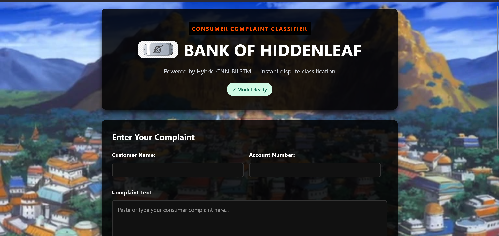
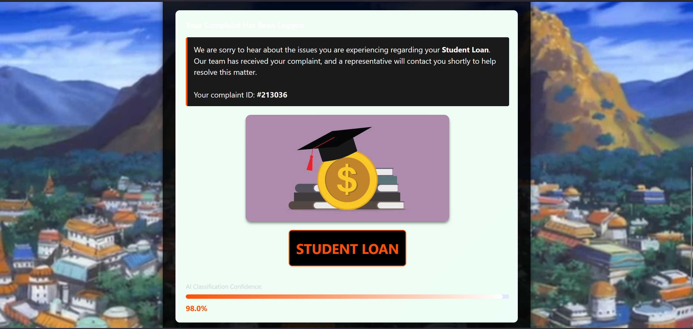

# 🗂️ Consumer Complaint Classifier

> **Deep Learning-Based NLP Classification System for Financial Complaints**  
> Capstone Project · Adhavan Ponram · 2026

A production-deployed web application that automatically classifies consumer financial complaints into product categories using a hybrid **CNN-BiLSTM** deep learning model. Built with Flask, trained on CFPB data, and live on AWS EC2.

---

## 📌 Table of Contents

- [Overview](#overview)
- [Demo](#demo)
- [Dataset](#dataset)
- [Model Architecture](#model-architecture)
- [Results](#results)
- [Tech Stack](#tech-stack)
- [Project Structure](#project-structure)
- [Setup & Installation](#setup--installation)
- [Running the App](#running-the-app)
- [Deployment](#deployment)
- [API & Database](#api--database)
- [Acknowledgements](#acknowledgements)

---

## Overview

Banks and financial institutions receive hundreds of thousands of consumer complaints every year. Manually routing each complaint to the correct product team is slow, expensive, and inconsistent.

This project trains four deep learning NLP architectures and selects the best one to automatically classify complaints into **9 financial product categories** — reducing manual effort and improving response time.

**Best Model:** CNN-BiLSTM Hybrid — **80.43% test accuracy**
- ~45,000 balanced complaint samples across 9 categories
- CNN-BiLSTM hybrid achieves **81% accuracy and 0.81 macro F1-score**
- Full Flask web app with Xano database integration
- Deployed live on **AWS EC2** with Gunicorn + tmux

---

## Demo

The app accepts a customer complaint in natural language, predicts the financial product category, and displays confidence scores for the top 3 predictions. Each submission is assigned a unique **6-digit Complaint ID** and logged to a cloud database automatically.

**Low-confidence guard:** If the model confidence is below 20%, the app politely asks the user to provide more details rather than returning a potentially incorrect classification.

### Screenshots

**Complaint Input Form**



> Naruto-themed UI — "Bank of Hiddenleaf" — with the Hidden Leaf Village as the background. Built with plain HTML + CSS, no JavaScript framework.

**Prediction Result**



> The model classified this complaint as **Student Loan** with **98.0% confidence**. Each category has a representative avatar image and an animated confidence bar.

---

## Dataset

**Source:** [Consumer Financial Protection Bureau (CFPB) — Consumer Complaint Database](https://catalog.data.gov/dataset/consumer-complaint-database)

| Property | Detail |
|---|---|
| Raw file | `complaints.csv` (millions of rows) |
| Columns used | `Product` + `Consumer complaint narrative` |
| Final dataset | ~45,000 rows (balanced) |
| Classes | 9 product categories |
| Samples per class | 5,000 (downsampled) |

### 9 Product Categories

| # | Category |
|---|---|
| 1 | Credit Reporting |
| 2 | Credit Card |
| 3 | Personal / Payday Loan |
| 4 | Mortgage |
| 5 | Debt Collection |
| 6 | Checking / Savings Account |
| 7 | Student Loan |
| 8 | Money Transfer / Services |
| 9 | Vehicle Loan |

### Data Preparation Steps

1. **Chunked loading** — read `complaints.csv` in 100K-row chunks to avoid memory overflow
2. **Drop nulls** — removed rows with no complaint narrative
3. **Category mapping** — unified 25+ verbose product names into 9 clean categories using a custom dictionary
4. **Class balancing** — downsampled each category to 5,000 samples (`random_state=42`)
5. **Text cleaning** — lowercased, removed punctuation, stopwords (NLTK), and special characters
6. **Tokenization & padding** — Keras Tokenizer (top 20K words) + `pad_sequences` (MAX_LEN = 150)

### Known Dataset Challenges

- **Missing narratives** — many rows had no complaint text; dropped entirely
- **Inconsistent labels** — same product appeared with multiple name variants; resolved with a mapping dictionary
- **Class imbalance** — Credit Reporting heavily overrepresented; fixed by downsampling
- **Redacted credentials** — `XXXX` placeholders throughout narratives; treated as non-signal noise

---

## Model Architecture

Four deep learning architectures were trained and compared:

| Trial | Architecture | Notes |
|---|---|---|
| 1 | SimpleRNN | Baseline; struggles with long sequences (vanishing gradient) |
| 2 | LSTM | Better long-range memory than SimpleRNN |
| 3 | BiLSTM | Reads sequences in both directions; improved context |
| 4 | **CNN-BiLSTM (Hybrid)** ✅ | **Best performer — ~89% accuracy** |

### Final Model: CNN-BiLSTM Hybrid

```
Embedding(vocab_size, 150)
    → SpatialDropout1D
    → Conv1D(128, kernel_size=5, relu)   ← local n-gram pattern extraction
    → BiLSTM(128)                         ← global sequence modeling (both directions)
    → Dense(64, relu)
    → Dense(9, softmax)
```

**Key architectural decisions:**
- **SpatialDropout1D** — drops entire feature maps after embedding to prevent over-reliance on specific word positions
- **Conv1D** — extracts local n-gram patterns (e.g., *"account was closed"*, *"charged twice"*) before the recurrent layer
- **Bidirectional LSTM** — doubles context capacity by processing sequences left-to-right and right-to-left simultaneously
- **Intermediate Dense(64)** — translates high-dimensional RNN output to class probabilities more effectively
- **ReduceLROnPlateau** — automatically reduces learning rate when validation loss stalls

---

## Results

| Model | Test Accuracy |
|---|---|
| SimpleRNN | 47.26% |
| LSTM | 76.51% |
| Bi-LSTM | 78.97% |
| **CNN-BiLSTM ★** | **80.43%** |

> **Training config:** Loss — Categorical Cross-Entropy · Optimizer — Adam · Early Stopping — `val_loss` patience=5 · All scores measured on a held-out 20% test split

All 4 models are saved as `.h5` files. The tokenizer and label encoder are serialized as `.pkl` files for deployment.

---

## Tech Stack

| Layer | Technology |
|---|---|
| ML / DL | TensorFlow · Keras · NLTK |
| Backend | Python 3 · Flask |
| Frontend | HTML5 · CSS3 (no JS framework) |
| Database | Xano (no-code REST API + cloud DB) |
| Deployment | AWS EC2 (Ubuntu, T3) · Gunicorn · tmux |
| File Transfer | WinSCP (SFTP) · PuTTY (SSH) |

---

## Project Structure

```
consumer-complaint-classifier/
│
├── app.py                              # Flask application
├── style.css                           # Frontend styles
├── templates/
│   └── index.html                      # Main UI template
├── static/
│   └── images/                         # Category avatar images
│       ├── credit_reporting.jpg
│       ├── credit_card.jpg
│       ├── mortgage.jpg
│       └── ...
│
├── model_4_hybrid_cnn_lstm(new).h5     # Trained CNN-BiLSTM model
├── tokenizer.pkl                       # Keras tokenizer
├── label_encoder.pkl                   # Sklearn label encoder
│
├── Python_1.ipynb                      # Training & experimentation notebook
└── README.md
```

> **Note:** The `.h5`, `.pkl` model files are not included in the repository due to size. See setup instructions below.

---

## Setup & Installation

### Prerequisites

- Python 3.8+
- pip

### 1. Clone the repository

```bash
git clone https://github.com/your-username/consumer-complaint-classifier.git
cd consumer-complaint-classifier
```

### 2. Install dependencies

```bash
pip install flask tensorflow keras nltk numpy requests scikit-learn
```

### 3. Download NLTK stopwords

```python
import nltk
nltk.download('stopwords')
```

### 4. Add model artifacts

Place the following files in the project root directory:

```
model_4_hybrid_cnn_lstm(new).h5
tokenizer.pkl
label_encoder.pkl
```

> These files are generated by running the training notebook (`Python_1.ipynb`). Download the CFPB dataset, run the notebook end-to-end, and the files will be saved automatically.

---

## Running the App

```bash
python app.py
```

The app starts on `http://localhost:5000` by default.

You can verify the model loaded correctly by hitting the health endpoint:

```
GET http://localhost:5000/health
```

Expected response:
```json
{ "status": "ok", "model_ready": true }
```

---

## Deployment

The app is deployed on **AWS EC2 (Ubuntu Server, T3 instance)** — accessible from anywhere via public IP.

### Step-by-Step EC2 Deployment Guide

#### 1. Launch EC2 Instance (AWS Console)

- Go to **AWS EC2 → Launch Instance**
- Choose **Ubuntu Server 22.04 LTS** (free tier eligible)
- Instance type: **t3.micro** (or t3.small for better performance under load)
- Create or select a **key pair** (`.pem` file) — save this, you need it for SSH
- Under **Security Group**, open inbound rules:
  - Port **22** (SSH) — your IP
  - Port **5000** (Flask/Gunicorn) — `0.0.0.0/0` (or restrict to your IP)
- Launch the instance and note the **Public IPv4 address**

#### 2. Transfer Project Files via WinSCP (Windows → EC2)

- Download and open **[WinSCP](https://winscp.net/)**
- New session → Protocol: **SFTP**
- Hostname: your EC2 **Public IPv4**
- Username: `ubuntu`
- Under **Advanced → SSH → Authentication**, load your `.pem` key file
- Connect and drag your project folder into `/home/ubuntu/`

> Make sure to include: `app.py`, `templates/`, `static/`, `model_4_hybrid_cnn_lstm(new).h5`, `tokenizer.pkl`, `label_encoder.pkl`

#### 3. SSH into the Instance via PuTTY (Windows)

- Download **[PuTTY](https://putty.org/)** and **PuTTYgen**
- Open PuTTYgen → Load your `.pem` file → Save as `.ppk`
- Open PuTTY:
  - Host: `ubuntu@<your-ec2-public-ip>`
  - Under **Connection → SSH → Auth**, browse to your `.ppk` file
  - Click **Open** to connect

#### 4. Set Up Python Environment on EC2

```bash
# Update system packages
sudo apt update && sudo apt upgrade -y

# Install pip and venv
sudo apt install python3-pip python3-venv -y

# Create and activate a virtual environment
python3 -m venv venv
source venv/bin/activate

# Install all dependencies
pip install flask tensorflow keras nltk numpy requests scikit-learn gunicorn

# Download NLTK stopwords
python3 -c "import nltk; nltk.download('stopwords')"
```

#### 5. Test the App Manually (Optional)

```bash
cd /home/ubuntu/your-project-folder
python3 app.py
```

Visit `http://<your-ec2-public-ip>:5000` in your browser to verify it works.

#### 6. Deploy with Gunicorn + tmux (Production)

```bash
# Install tmux if not already present
sudo apt install tmux -y

# Create a persistent tmux session
tmux new -s complaint-app

# Inside the tmux session — activate venv and start Gunicorn
source venv/bin/activate
gunicorn -w 2 -b 0.0.0.0:5000 app:app

# Detach from tmux WITHOUT killing the process
# Press: Ctrl+B, then D
```

The app now keeps running even after you close PuTTY / disconnect SSH.

#### Useful tmux commands

```bash
tmux attach -t complaint-app   # Re-attach to the running session
tmux ls                        # List all active sessions
tmux kill-session -t complaint-app  # Stop the app
```

#### 7. Restarting After EC2 Reboot

```bash
# Re-attach and restart Gunicorn
tmux new -s complaint-app
source venv/bin/activate
gunicorn -w 2 -b 0.0.0.0:5000 app:app
```

> **Tip:** For a fully automatic startup on reboot, you can configure a `systemd` service instead of tmux — but tmux is simpler for development and small-scale deployments.

### Deployment Architecture Summary

```
User Browser
    │  HTTP
    ▼
AWS EC2 (Ubuntu T3)
    └── tmux session
         └── Gunicorn (WSGI, 2 workers)
              └── Flask app (app.py)
                   ├── Keras CNN-BiLSTM model (.h5)
                   ├── Tokenizer (.pkl)
                   └── Xano REST API (complaint logging)
```

---

## API & Database

Every complaint submission is automatically logged to a **Xano** cloud database via a REST API call.

**Payload sent to Xano on each prediction:**

```json
{
  "complaint_id": 482931,
  "customer_name": "John Doe",
  "account_number": "12345",
  "complaint_type": "Credit Reporting",
  "complaint_description": "Full complaint text here..."
}
```

Fallback handling: if the Xano API is unreachable (5s timeout), the app catches the error gracefully and still returns the prediction to the user.

> **Note:** The Xano endpoint URL in `app.py` has been masked for public release.

---

## Acknowledgements

- **Dataset:** [Consumer Financial Protection Bureau (CFPB)](https://catalog.data.gov/dataset/consumer-complaint-database) via data.gov
- **Frameworks:** TensorFlow / Keras, Flask, NLTK
- **Infrastructure:** AWS EC2, Xano, Gunicorn

---

*Built as a Capstone Project · 2026 · Adhavan Ponram*
